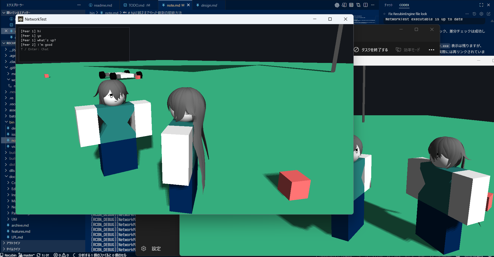
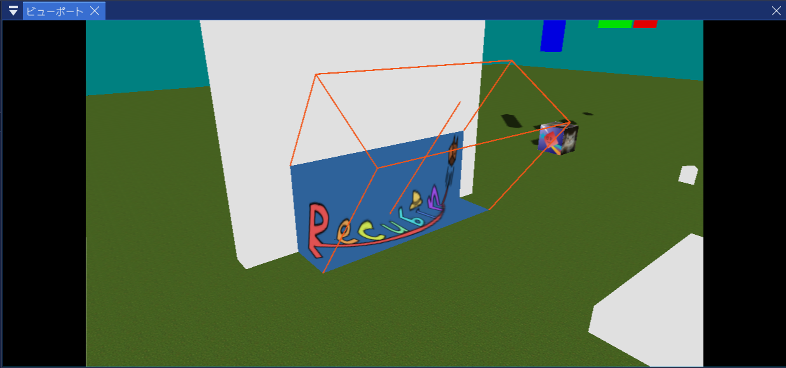
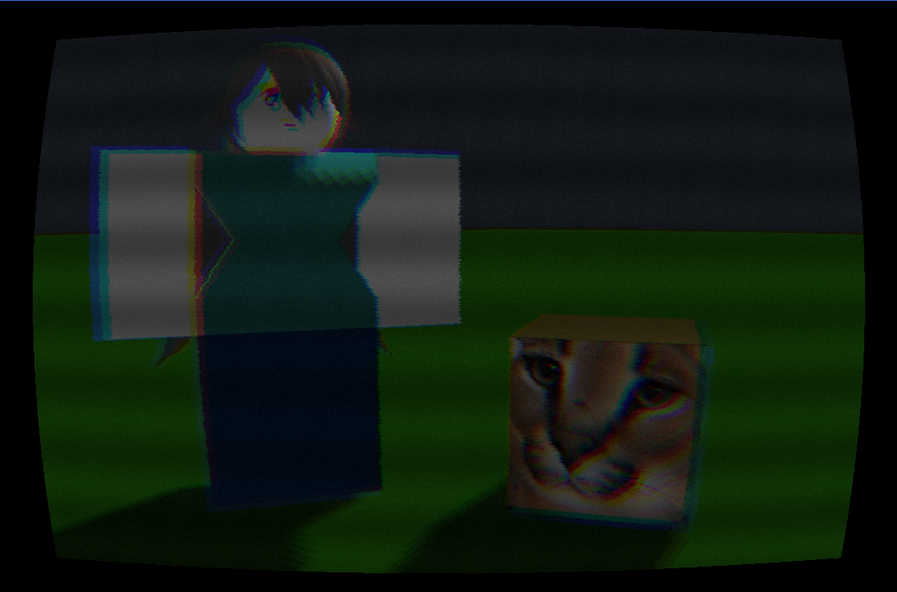

# Recubin -Powering imagination again-
[](https://isocpp.org/)
[](https://luau-lang.org/)
[](https://www.opengl.org/)


Recubinは、Luauスクリプティング、物理遊び、複数Workspaceを備えたC++製のローカルゲームエンジンです。
Robloxに影響を受けつつ、「もっと自由にローカルで遊べたら」を形にしています。

| プラットフォーム | 対応状況 |
|---|---|
| Windows | ✅ 対応 |
| Linux | 🚧 対応予定 |
| macOS | ⚠️ v1.0のみ |

[パッケージ](https://github.com/RadiantBird/Recubin/releases)はここからダウンロードできます！

## English summary

Recubin is a local game engine inspired by Roblox, featuring Luau scripting, physics, and multiple Workspaces.
[Download Recubin](https://github.com/RadiantBird/Recubin/releases) :DD

## 目標
- 誰でも簡単にゲームを開発し、ローカルで公開できるように。
- Robloxでできなかったことを実現する。
- わかりやすいエディターを作る。直感的であるように。
- 物理で遊べるようにする。

## エンジンの機能

### Cube


このエンジンではCubeが最小単位で、世界を彩ります。
何でも作れるでしょう…

### 物理制約


物理制約を使えば、このように車も作ることができます。
まだ拙いところもありますが、今後改善していく予定です。

### 地形


地形を使って膨大な量の建設をこなしましょう。
爆破してバラバラになる！！…とかはありませんが、
2011年の熱狂を再現するにはぴったりです。

### パスファインディング


Humanoidクラスによるパスファインディングで、
悩まずにゲーム制作が可能です。あなたのNPCはゾンビではありません、
しつこく障害物を避けて、追ってくるでしょう！！！

### 天候


パーリンノイズによる雲と、
パーティクルインスタンスを流用した雰囲気づくりのインスタンスです。
雷もあるよ！


### スクリプト
もちろんスクリプトが重要だって知ってますよ。
ちゃんとあります。**Luau**です。ドキュメントは全然ないんですけどね。
[定義ファイル](RCBN.luah)を見たり、
リポジトリにあるサンプルスクリプトを見てもらうとわかる気がします。
よければ、ドキュメント一緒に書きましょう！

### ネットワーク


インターネットが欲しいですか？
```
＿人人人人人人人人人人人人人人＿
＞　インターネットあります！　＜
￣Y^Y^Y^Y^Y^Y^Y^Y^Y^Y^Y^Y￣
```
……まあサーバーがないので、TailScaleとかは必須ですね。  
サーバーが欲しいなら……私は知りません。

### SurfaceMark


プロジェクターみたいにいろんなところに画像をべたっと貼れます。  
なんでも貼ってしまへ。

### ポストエフェクト


デフォルトのグラフィックがつまらない？  
ちょっとだけ装飾しよう！

インダストリアルからVHSまでだいたいカスタマイズできます。  
ワイヤーフレームだけってのはまだないです。欲しい人がいたら作ります(－O－)

### 複数ワークスペース
これ試してみると本当に面白いと思います。
一つのゲームでいろんなステージを作れて、
次元移動的なことができるので。
例えばこんな感じ。

プレイヤーのキャラクターを別のWorkspaceの子にするだけで、別世界へ移動できます。

```lua
-- Portal
local frontrooms: Workspace = system.Frontrooms
local backrooms:  Workspace = system.Backrooms

local fButton, bButton = frontrooms.Button, backrooms.Button
local p1:ProximityPrompt, p2:ProximityPrompt = fButton.Prompt, bButton.Prompt

local char = nil
User.CharacterAdded:Connect(function(c)
    char = c
    print(char)
end)

p1.Triggered:Connect(function()
    char.Parent = backrooms
end)

p2.Triggered:Connect(function()
    char.Parent = frontrooms
end)
```

---
あといろいろ…多分面白いものがたくさんあります。

## あるかもしれない質問

- Q. なんでUserのキャラクターはPlayerなの？
- A. Userはあなたのことです。一方、Playerは道化(アバター)に過ぎません。
つまり…あなたとアバターは異なる分身として表現されます。

## v2.0について

v2.0では、さらに面白い要素、いろいろなインスタンス、
機能改善などを予定しています。
まだうまく思いつかないんですけどね…
期待しておいてくれるとうれしいです。

## Macについて
  Metalだけでも困難ですが、PhysXのサポートも薄く、
  将来的なVulkan移行、Mac対応ライブラリ痩せを考慮すると、
  Mac対応は今後しないことを決めました。
  Mac版はとりあえずv1.0のパッケージは何とか出します。
  プルリクエストとか経験がないんですけど、してくれるとうれしいかもです。

## 使用中の技術
- C++
- OpenGL(GL/GLFW)
- Luau
- stb_image
- cgltf
- ImGui & ImGuizmo
- YAML(yaml-cpp)
- miniaudio
- Signalsmith Stretch & Signalsmith Linear
- PhysX
- Box3D
- Windows bat
- Python
- font-awesome
- recastnavigation
- xatlas
- enet

## 使用予定の技術
- DirectX(Windows最適化)
- Vulkan(Linuxなど)

  ### Luar言語
  - Rust(Luarコンパイラ)
  - この言語は現在試験的です。
  - 詳細は[このファイル](doc/LPL.md)をご覧ください。
  
---

スクリーンショット内の髪型モデルは curuata さんの制作物です。  
Licensed under [CC BY 4.0](https://creativecommons.org/licenses/by/4.0/).
