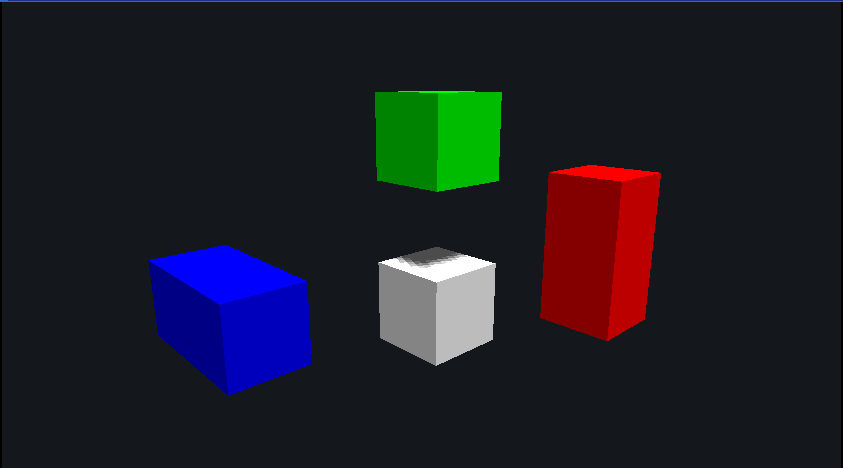
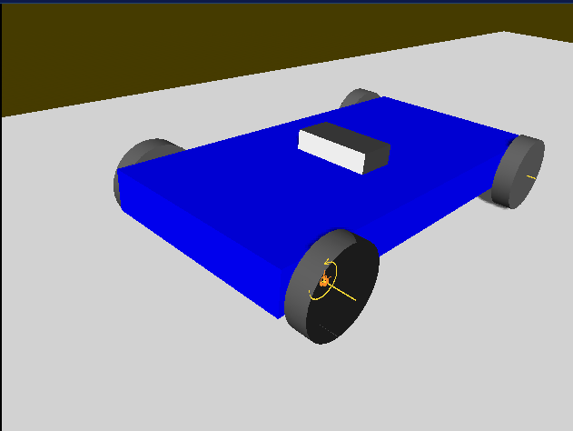
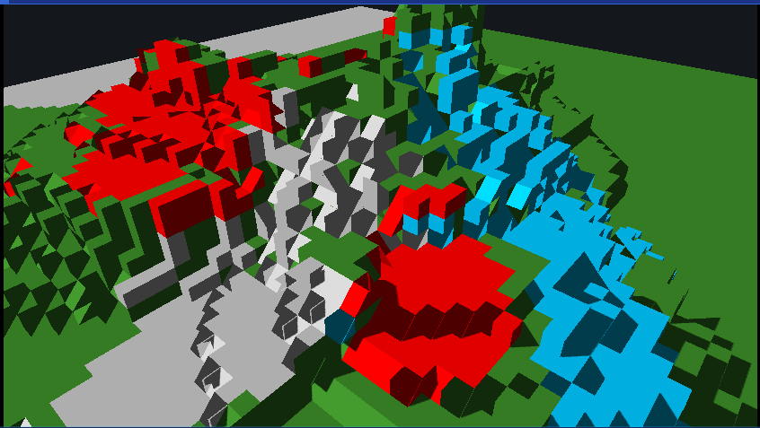
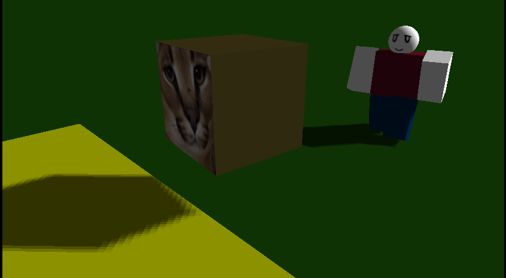
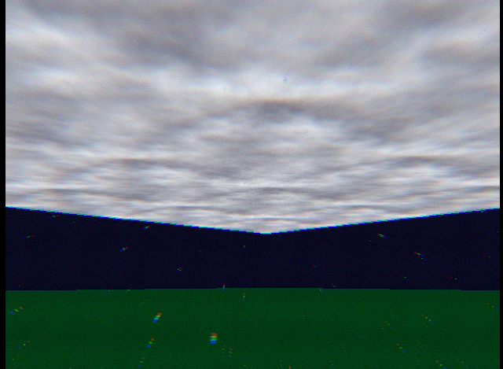
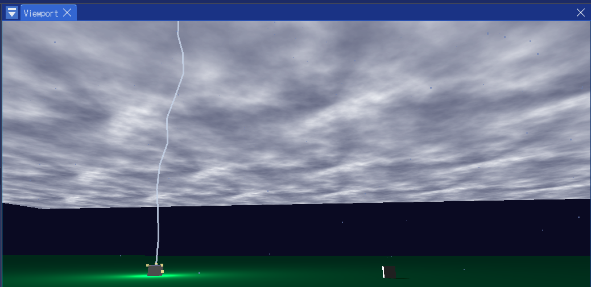

# Recubin -Powering imagination again-

RecubinはC++で作成されたゲームエンジンで、
楽しい物理エンジン、Luauでコーディング、複数Workspaceなど、
ゲーム開発を楽しくしてくれる要素がたくさんです。
Windowsで動作します。
Linux対応予定です。
(開発休止中…デバッグは可能な限りやります)

[パッケージ](https://github.com/RadiantBird/Recubin/releases)はここからダウンロードできます！

## 目標
- 誰でも簡単にゲームを開発し、ローカルで公開できるように。
- Robloxでできなかったことを実現する。
- わかりやすいエディターを作る。直感的であるように。
- 物理で遊べるようにする。

## エンジンの機能

### Cube

このエンジンではCubeが最小単位で、世界を彩ります。
何でも作れるでしょう…

### 物理制約

物理制約を使えば、このように車も作ることができます。
まだ拙いところもありますが、今後改善していく予定です。

### 地形

地形を使って膨大な量の建設をこなしましょう。
爆破してバラバラになる！！…とかはありませんが、
2011年の熱狂を再現するにはぴったりです。

### パスファインディング

Humanoidクラスによるパスファインディングで、
悩まずにゲーム制作が可能です。あなたのNPCはゾンビではありません、
しつこく障害物を避けて、追ってくるでしょう！！！

### 天候

パーリンノイズによる雲と、
パーティクルインスタンスを流用した雰囲気づくりのインスタンスです。
雷もあるよ！

### スクリプト
もちろんスクリプトが重要だって知ってますよ。
ちゃんとあります。**Luau**です。ドキュメントは全然ないんですけどね。
[定義ファイル](RCBN.luah)を見たり、
リポジトリにあるサンプルスクリプトを見てもらうとわかる気がします。
よければ、ドキュメント一緒に書きましょう！

### 複数ワークスペース
これ試してみると本当に面白いと思います。
一つのゲームでいろんなステージを作れて、
次元移動的なことができるので。
まだあんまりテストしてませんけどね。

---
あといろいろ…多分面白いものがたくさんあります。

## あるかもしれない質問

- Q. なんでUserのキャラクターはPlayerなの？
- A. Userはあなたのことです。一方、Playerは道化(アバター)に過ぎません。
つまり…あなたとアバターは異なる分身として表現されます。

## v2.0について

いまのところ、このエンジンにはネットワークがありません。
ちょっと実装されてるんですけどね。
ちょっと難しいし、通信の基盤自体はあるのでなんとかなりそうなんですが、
課題がまだいろいろとあるので、v1.0ではネットワークは実装せずに、
安定性向上に取り組みたいと思っています。

---

v2.0では、P2P(?)ネットワーク機能に加えて、
面白い要素、いろいろなインスタンス、機能改善などを予定しています。
まだうまく思いつかないんですけどね…
期待しておいてくれるとうれしいです。

## Macについて
  Metalだけでも困難ですが、PhysXのサポートも薄く、
  将来的なVulkan移行、Mac対応ライブラリ痩せを考慮すると、
  Mac対応は今後しないことを決めました。
  Mac版はとりあえずv1.0のパッケージは何とか出します。
  プルリクエストとか経験がないんですけど、してくれるとうれしいかもです。

## 使用中の技術
- C++
- OpenGL(GL/GLFW)
- Luau
- stb_image
- cgltf
- ImGui & ImGuizmo
- YAML(yaml-cpp)
- miniaudio
- Signalsmith Stretch & Signalsmith Linear
- PhysX
- Windows bat
- Python
- font-awesome
- recastnavigation
- xatlas
- enet

## 使用予定の技術
- DirectX(Windows最適化)
- Vulkan(Linuxなど)

  ### Luar言語
  - Rust(Luarコンパイラ)
  - この言語は現在試験的です。
  - 詳細は[このファイル](doc/LPL.md)をご覧ください。
  
---
